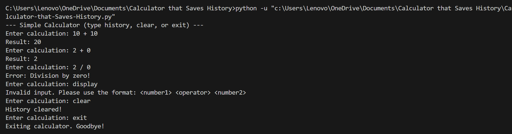

# 🧮 Calculator with History

A beginner-friendly and interactive Python project that performs basic arithmetic calculations and **saves a history of each operation** to a text file. This project demonstrates the use of Python essentials like functions, conditionals, file handling, loops, and user input—all in a single script.

---

## 📸 Screenshot

---

## 📌 Features

- Performs basic arithmetic: addition, subtraction, multiplication, and division
- Saves each calculation to a `history.txt` file
- Displays past calculations with the `history` command
- Clears saved history with the `clear` command
- Handles invalid input and division by zero
- Simple command-line interface — no external libraries needed

---

## 🎯 Why I Built This

I created this project to **apply and practice core Python concepts** in a meaningful way. It helped me build confidence in:
- Writing functions to handle logic
- Managing input and output with users
- Working with files to save data (history)
- Structuring reusable and readable code

---

## 🧠 Concepts Used

- `input()` – to accept user calculations and commands  
- `open()` – to read from and write to the `history.txt` file  
- `try-except` – to handle unexpected input and errors  
- String manipulation – for formatting output and saving to file  
- Conditional logic – to handle operations and edge cases  
- Loops – to keep the calculator running until the user exits  

---

## ⚙️ How It Works

1. User is prompted to enter a calculation (e.g., `10 + 5`)
2. The calculator splits the input into number1, operator, number2
3. Performs the operation and shows the result
4. Saves the expression and result to `history.txt`
5. User can type:
   - `history` to view previous calculations
   - `clear` to delete all history
   - `exit` to quit the program

---

## 📂 Files Included

- `calculator.py` – main Python script  
- `history.txt` – auto-generated file to store calculation history  
- `screenshot.png` – terminal output (optional for GitHub display)  

---

## 📚 License

This project is open-source and free to use.

---

## 🙋‍♂️ Author

**Rohan Nayak**  
Connect with me on [LinkedIn](https://www.linkedin.com/rohannayak360)
